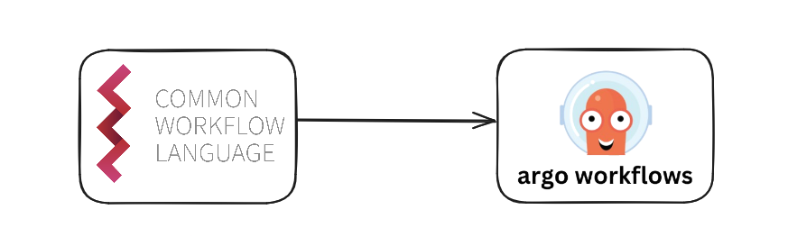

# Proteus

Proteus is a tool for transpiling resources from the Common Workflow Language into resources types compatible with Argo Workflows. 

The input and output of Proteus is only files. The output file should represent a valid Argo Workflow resource, which can then be parsed directly into Argo Workflows.



## Installation

The tool is available as a command line interface that can be downloaded to Linux, Max, and Windows.

#### On Linux
```
# Curl the binary
curl -sLO https://github.com/SerRichard/proteus/releases/download/<version>/proteus-linux-amd64.gz

# Unzip
gunzip proteus-linux-amd64.gz

# Make executable
chmod +x proteus-linux-amd64

# Move binary
mv ./proteus-linux-amd64 /usr/local/bin/proteus

# Check installation
proteus --help
```

Executables are also available with each release for Windows and Mac, they are available for download under the following names. Installation instructions for each will to follow.

#### For Mac
```
proteus-darwin-amd64.gz
```

#### For Windows
```
proteus-windows-amd64
```
